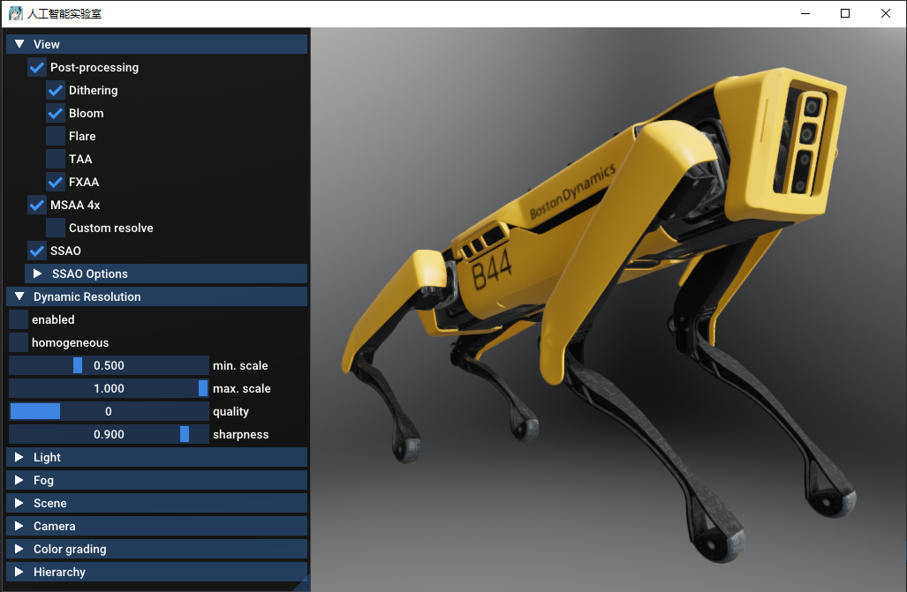

# fwlab

fwlab是一个人工智能实验室。



## 编译说明

1. 下载项目。

```sh
git clone https://gitee.com/fwlab/fwlab.git
cd fwlab
git submodule update --init
```

2. 安装以下软件：

```sh
sudo apt install build-essential clang libglu1-mesa-dev libc++-dev libc++abi-dev ninja-build libxi-dev cmake

sudo apt install libsdl2-2.0-0 libsdl2-dev
```

* ninja下载地址：https://github.com/ninja-build/ninja/releases
* cmake下载地址：https://github.com/Kitware/CMake/releases

3. 使用`clang`作为默认编译器。

```sh
sudo update-alternatives --install /usr/bin/cc cc /usr/bin/clang 100
sudo update-alternatives --install /usr/bin/c++ c++ /usr/bin/clang++ 100
```

4. 在`third_party/filament`目录执行以下代码。

```sh
mkdir -p out/cmake-release
cd out/cmake-release
cmake -G Ninja -DCMAKE_BUILD_TYPE=Release -DFILAMENT_SUPPORTS_VULKAN=OFF -DCMAKE_INSTALL_PREFIX=../release/filament ../..
ninja
ninja install
```

5. 将`third_party/filament/out/release/filament/bin`目录添加到环境变量。

```sh
cd /etc/profile.d
sudo sh -c 'echo export PATH=/home/{username}/fwlab/third_party/filament/out/release/filament/bin:\$PATH > filament.sh'
sudo chmod +x filament.sh
source filament.sh
echo $PATH
```

6. 在`fwlab`根目录执行以下代码。

```
mkdir build
cd build
cmake ..
make
```