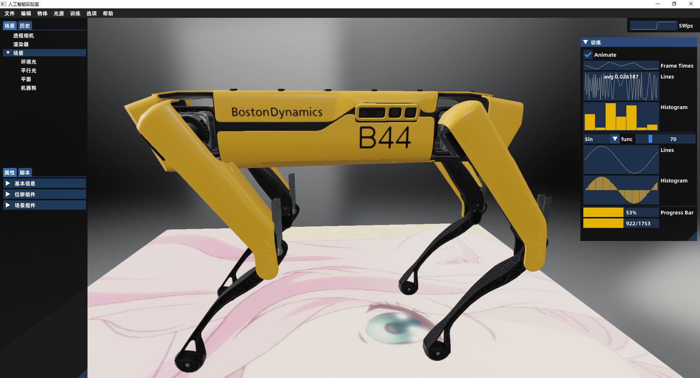

# fwlab

fwlab是一个人工智能实验室。

技术栈：C/C++、OpenGL、imgui、SDL2、filament、bullet3、OCCT、Tensorflow。



## 主要功能

- [ ] 三维编辑
  - [ ] 三维建模
  - [ ] 场景搭建
  - [ ] 物理引擎
- [ ] 机器狗训练
  - [ ] 动作训练
  - [ ] 视觉训练
  - [ ] 听觉训练
- [ ] 人形机器人训练
  - [ ] 语言训练
- [ ] 模拟生物进化
  - [ ] 基因编码
  - [ ] 外形进化

## 使用Windows编译项目

推荐在Windows上编译项目，使用Ubuntu编译参考`docs/BUILD.md`。编译调试版大约需要25G磁盘空间。

1. 下载项目。

```sh
git clone https://gitee.com/fwlab/fwlab.git
cd fwlab
git submodule update --init
```

2. 安装以下软件：

Visual Studio 2019, 安装时选中使用C++的桌面开发。

3. 配置`filament`、`bullet3`、`OCCT`、`fwlab`项目。

根据需要，双击`config/debug.cmd`或`config/release.cmd`，将项目配置成调试版或发行版。

4. 编译`filament`项目。

使用Visual Studio 2019打开目录`third_party/filament`。

右键`CMakeLists.txt`，选择生成。

右键`CMakeLists.txt`，选择安装。

将目录`third_party/filament/out/install/bin`添加到环境变量，保证`cmgen`、`matc`、`resgen`能在命令行运行。

5. 编译`bullet3`项目。

使用Visual Studio 2019打开目录`third_party/bullet3`。

右键`CMakeLists.txt`，选择生成。

右键`CMakeLists.txt`，选择安装。

6. 编译`tcl`项目。(暂时不需要)

在开始菜单中，打开`Developer Command Prompt for VS 2019`工具，切换到目录`third_party/tcl/win`，执行以下代码。

```sh
nmake -f makefile.vc
```

7. 编译`OCCT`项目。(暂时不需要)

使用Visual Studio 2019打开目录`third_party/OCCT`。

右键`CMakeLists.txt`，选择生成。

右键`CMakeLists.txt`，选择安装。

将目录`third_party/OCCT/out/install/win64/vc14/bind`添加到环境变量。

8. 编译`fwlab`项目。

使用Visual Studio 2019打开项目根目录`fwlab`。

右键`CMakeLists.txt`，选择生成，生成的文件是`out/build/fwlab.exe`。

工具栏设置启动项为`out/build/fwlab.exe`，点击`fwlab.exe`启动程序。

右键`CMakeLists.txt`，选择安装，可以将所需文件安装到目录`out/install`。

## 参考文档

C/C++: https://www.cplusplus.com/reference/

OpenGL: https://www.khronos.org/registry/OpenGL-Refpages/

imgui: https://imgui-test.readthedocs.io/en/latest/

SDL2: https://wiki.libsdl.org/

filament: https://google.github.io/filament/

bullet3: https://github.com/bulletphysics/bullet3/raw/master/docs/Bullet_User_Manual.pdf

OCCT: https://documentation.help/Open-Cascade/occt__tutorial.html

OCCT: https://dev.opencascade.org/doc/overview/html/index.html

Tensorflow: https://tensorflow.google.cn/api_docs/cc

Tcl/Tk: http://www.tcl.tk/doc/

## 授权

fwlab: MIT License

imgui: MIT License

SDL2: Zlib License

filament: Apache-2.0 License

bullet3: Zlib License

OCCT: LGPL-2.1 License

tensorflow: Apache-2.0 License

rapidjson: MIT License

## 开源项目

感谢以下开源项目：

imgui: https://github.com/ocornut/imgui

SDL2: http://www.libsdl.org/

filament: https://github.com/google/filament

bullet3: https://github.com/bulletphysics/bullet3

OCCT: https://github.com/Open-Cascade-SAS/OCCT

tensorflow: https://github.com/tensorflow/tensorflow

rapidjson: https://github.com/Tencent/rapidjson

tclsh: http://www.tcl.tk/software/tcltk/downloadnow85.html